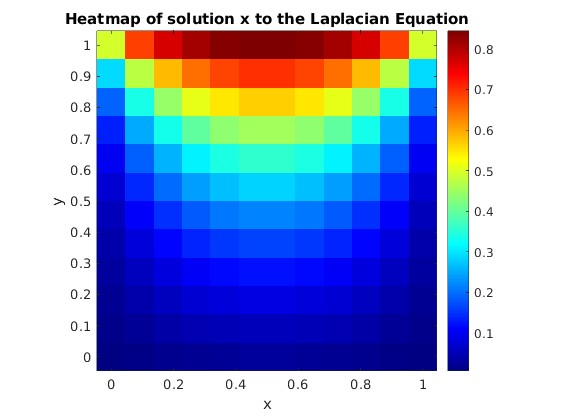
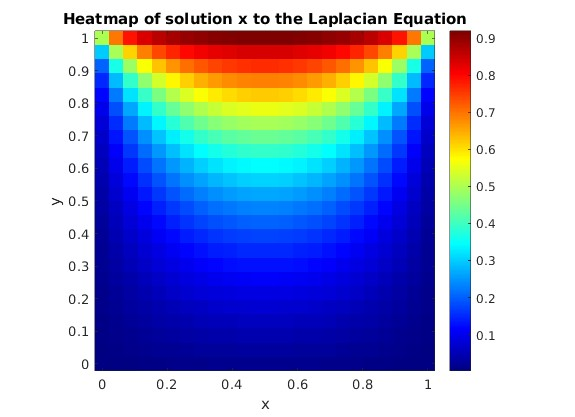
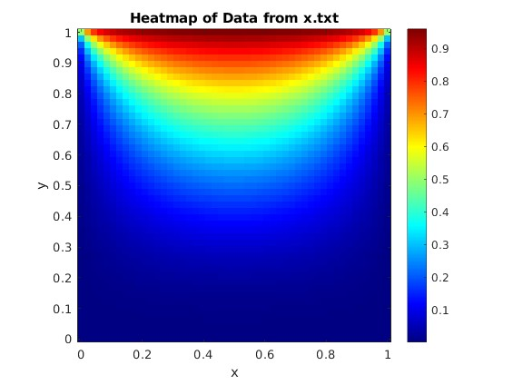

# Assignment 2
**Name:** Aryan Agarwal
**Roll No.:** 22EC39006  

### Experimental Setup
- `fdm.hpp` implemented to generate the coefficient matrix **A** and vector **b** corresponding to the 2D Laplacian equation with the specific boundary conditions
- `math.hpp` built as a lightweight linear algebra library to support basic vector and matrix operations required for the solvers  
- `iter.hpp` designed to contain the implementations of all iterative solvers used in this assignment (SOR, SD, MR, CG, BiCGSTAB)  
- `main.cpp` integrates all modules (`fdm.hpp`, `math.hpp`, `iter.hpp`) and executes the experiments across various grid sizes, logging iteration counts and timings for comparison  
- Initial guess $x_0$ set to a zero vector for all runs  
- Error tolerance fixed at $10^{-8}$ for convergence across all methods

### Optimal $\omega$ for Successive Over Relaxation 
| $\Delta x = \Delta y = h$ | $\omega_{opt}$ |
|:----:|:------:|
| 0.08 | 1.5968 |
| 0.04 | 1.6164 |
| 0.02 | 1.6164 |
### Successive Over-Relaxation (SOR, Optimal ω)
#### Preprocessing
1. Estimate spectral radius $\rho(J)$ of Jacobi iteration matrix $J = I - D^{-1}A$ using the power method  
2. Compute optimal relaxation factor  
   $$
   \omega_{\text{opt}} = \frac{2}{1 + \sqrt{1 - \rho^2}}
   $$
3. Clamp $\omega_{\text{opt}}$ to $(0,2)$ 

#### Iteration
1. Choose initial guess $x^{(0)}$
5. For $k = 0, 1, 2, \dots$ until convergence Do:  
    1. For $i = 1, 2, \dots, n$:  
        1. Compute  
        $$
        x_i^{(k+1)} = (1-\omega)\,x_i^{(k)} + \frac{\omega}{a_{ii}}
        \left( b_i - \sum_{j=1}^{i-1} a_{ij}x_j^{(k+1)} - \sum_{j=i+1}^{n} a_{ij}x_j^{(k)} \right)
        $$  
    2. EndFor  
    3. Check convergence using infinity norm:  
        $$
        \text{if}\; \|x^{(k+1)} - x^{(k)}\|_\infty \;\leq\; \text{tol}\,\big(1 + \|x^{(k+1)}\|_\infty\big) \; \text{then Stop}
        $$    
6. EndDo

### Steepest Descent (SD)
1. Choose initial guess $x^{(0)}$; Compute initial residual $r^{(0)} = b - A x^{(0)}$  

3. For $k = 0, 1, 2, \dots$ until convergence Do:  
    1. Compute search direction  
    $$
    p^{(k)} = A r^{(k)}
    $$  
    2. Compute step length  
    $$
    \alpha_k = \frac{r^{(k)T} r^{(k)}}{r^{(k)T} p^{(k)}}
    $$  
    3. Update solution  
    $$
    x^{(k+1)} = x^{(k)} + \alpha_k r^{(k)}
    $$  
    4. Update residual  
    $$
    r^{(k+1)} = r^{(k)} - \alpha_k p^{(k)}
    $$  
    5. Check convergence: 
    $$
    \text{if }\, \|r^{(k+1)}\|_2 \leq \text{tol}\cdot\|b\|_2 \;\text{then Stop}  
    $$
4. EndDo

### Minimal Residual (MR)
1. Choose initial guess $x^{(0)}$; Compute initial residual $r^{(0)} = b - A x^{(0)}$  

3. For $k = 0, 1, 2, \dots$ until convergence Do:  
    1. Compute search direction  
    $$
    p^{(k)} = A r^{(k)}
    $$  
    2. Compute step length  
    $$
    \alpha_k = \frac{p^{(k)T} r^{(k)}}{p^{(k)T} p^{(k)}}
    $$  
    3. Update solution  
    $$
    x^{(k+1)} = x^{(k)} + \alpha_k r^{(k)}
    $$  
    4. Update residual  
    $$
    r^{(k+1)} = r^{(k)} - \alpha_k p^{(k)}
    $$  
    5. Check convergence: 
    $$
    \text{if }\, \|r^{(k+1)}\|_2 \leq \text{tol}\cdot\|b\|_2 \;\text{then Stop}  
    $$
4. EndDo

### Conjugate Gradient (CG) 
1. Choose initial guess $x^{(0)}$; compute initial residual $r^{(0)} = b - A x^{(0)}$  
2. Set $p^{(0)} = r^{(0)}$  
3. For $k = 0, 1, 2, \dots$ until convergence Do:  
    1. Compute step length  
    $$
    \alpha_k = \frac{r^{(k)T} r^{(k)}}{p^{(k)T} (A p^{(k)})}
    $$  
    3. Update solution  
    $$
    x^{(k+1)} = x^{(k)} + \alpha_k p^{(k)}
    $$  
    4. Update residual  
    $$
    r^{(k+1)} = r^{(k)} - \alpha_k (A p^{(k)})
    $$  
    5. Compute $\beta_k$  
    $$
    \beta_k = \frac{r^{(k+1)T} r^{(k+1)}}{r^{(k)T} r^{(k)}}
    $$  
    6. Update search direction  
    $$
    p^{(k+1)} = r^{(k+1)} + \beta_k p^{(k)}
    $$  
    7. Check convergence: 
    $$
    \text{if }\, \|r^{(k+1)}\|_2 \leq \text{tol}\cdot\|b\|_2 \;\text{then Stop}  
    $$ 
4. EndDo  

### Biconjugate Gradient Stabilized (BiCGSTAB) 
1. Choose initial guess $x^{(0)}$; compute initial residual $r^{(0)} = b - A x^{(0)}$  
2. Set $r^{*} = r^{(0)}$, $p^{(0)} = r^{(0)}$  
3. For $k = 0, 1, 2, \dots$ until convergence Do:  
    1. Compute $A p^{(k)}$ and step length  
    $$
    \alpha_k = \frac{r^{(k)T} r^{*}}{(A p^{(k)})^T r^{*}}
    $$  
    2. Compute intermediate residual  
    $$
    s^{(k)} = r^{(k)} - \alpha_k (A p^{(k)})
    $$  
    3. Compute $A s^{(k)}$ and $\omega_k$  
    $$
    \omega_k = \frac{(A s^{(k)})^T s^{(k)}}{(A s^{(k)})^T (A s^{(k)})}
    $$  
    4. Update solution  
    $$
    x^{(k+1)} = x^{(k)} + \alpha_k p^{(k)} + \omega_k s^{(k)}
    $$  
    5. Update residual  
    $$
    r^{(k+1)} = s^{(k)} - \omega_k (A s^{(k)})
    $$  
    6. Compute $\beta_k$  
    $$
    \beta_k = \frac{r^{(k+1)T} r^{*}}{r^{(k)T} r^{*}} \cdot \frac{\alpha_k}{\omega_k}
    $$  
    7. Update search direction  
    $$
    p^{(k+1)} = r^{(k+1)} + \beta_k \big(p^{(k)} - \omega_k (A p^{(k)})\big)
    $$  
    8. Check convergence: 
    $$
    \text{if }\, \|r^{(k+1)}\|_2 \leq \text{tol}\cdot\|b\|_2 \;\text{then Stop}  
    $$
4. EndDo  

### Observations (Iterations + Time)

<table>
  <thead>
    <tr>
      <th rowspan="2">Solver</th>
      <th colspan="2">0.02</th>
      <th colspan="2">0.04</th>
      <th colspan="2">0.08</th>
    </tr>
    <tr>
      <th>Iters</th>
      <th>Time (ms)</th>
      <th>Iters</th>
      <th>Time (ms)</th>
      <th>Iters</th>
      <th>Time (ms)</th>
    </tr>
  </thead>
  <tbody>
    <tr>
      <td><b>Successive over Relaxation (SOR)</b></td>
      <td>768</td><td>17823</td>
      <td>206</td><td>363.62</td>
      <td>52</td><td>16.102</td>
    </tr>
    <tr>
      <td><b>Steepest Descent (SD)</b></td>
      <td>7232</td><td>205650</td>
      <td>1921</td><td>3769.7</td>
      <td>539</td><td>68.356</td>
    </tr>
    <tr>
      <td><b>Minimal Residual (MR)</b></td>
      <td>7058</td><td>243420</td>
      <td>1881</td><td>3736.2</td>
      <td>529</td><td>72.486</td>
    </tr>
    <tr>
      <td><b>Conjugate Gradient (CG)</b></td>
      <td>134</td><td>4715.3</td>
      <td>67</td><td>136.39</td>
      <td>33</td><td>10.476</td>
    </tr>
    <tr>
      <td><b>Biconjugate Gradient Stabilized (BiCGSTAB)</b></td>
      <td>53</td><td>3663.5</td>
      <td>51</td><td>211.39</td>
      <td>24</td><td>12.966</td>
    </tr>
  </tbody>
</table>

### Solution Images
#### $\Delta x = \Delta y = h =  0.08$

#### $\Delta x = \Delta y = h =  0.04$

#### $\Delta x = \Delta y = h =  0.02$
